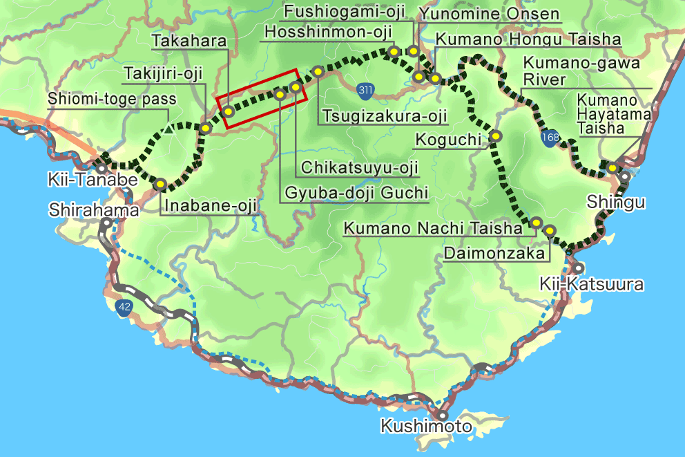

# Kumano Kodou 2021 Trip Outline

## Table of Content <!-- omit in toc -->
* [Overview](#overview)
* [YAMAP Model Courses](#yamap-model-courses)
* [Plane Tickets](#plane-tickets)
* [Day 1: Flying to Shirahama City](#day-1-flying-to-shirahama-city)
* [Day 2: Bus + Hiking; Shirahama City to Takahara Village](#day-2-bus--hiking-shirahama-city-to-takahara-village)
* [Day 3: Hiking; Takahara to Chikatsuyu](#day-3-hiking-takahara-to-chikatsuyu)
* [Day 4: Hiking + Bus; Chikatsuyu to Hongu Taisha](#day-4-hiking--bus-chikatsuyu-to-hongu-taisha)
* [Hike: Chikatsuyu to Kumano Hongu Taisha](#hike-chikatsuyu-to-kumano-hongu-taisha)
  * [Option 1: Full Walk; 25 km](#option-1-full-walk-25-km)
  * [Option 2: Intermediate Walk; 17 km](#option-2-intermediate-walk-17-km)
  * [Option 3: Highlight Walk; 7.5 km](#option-3-highlight-walk-75-km)
* [Day 5: Boat Tour \& Back to Shirahama City](#day-5-boat-tour--back-to-shirahama-city)
* [Resources](#resources)

## Overview

| Day   | What                           | Hotel                                                                        |
| ----- | ------------------------------ | ---------------------------------------------------------------------------- |
| Day 1 | Flying in & spending the night |
| Day 2 | Bus + Hiking --> Takahara      | [Kirinosato Takahara](https://goo.gl/maps/qJw4wfz4bav6q38h7)                 |
| Day 3 | Hike --> Chikatsuyu            | [Guest House Minshuku Momiji-no-Sato](https://goo.gl/maps/C3ZMj2rBvSQst7sK7) |
| Day 4 | Bus + Hike --> Yunomine Onsen  | [Minshuku Kuraya](https://goo.gl/maps/qf3SoLcax3r9h2K36)                     |
| Day 5 | Boat + Bus --> Shirahama City  |
| Day 6 | Beach at Shirahama City        |
| Day 7 | Beach at Shirahama City        |
| Day 8 | Fly back                       |

## YAMAP Model Courses
* [Kii-Tanabe Station - Inabane Oji / 紀伊田辺駅～稲葉根王子 - YAMAP](https://yamap.com/model-courses/24366)
* [Inabane-Oji ~ Takijiri-Oji / 稲葉根王子～滝尻王子 - YAMAP](https://yamap.com/model-courses/24367)
* [Shimomisu - Peeking Bridge / 下三栖～覗橋 - YAMAP](https://yamap.com/model-courses/24368)
* [Takijiri-Oji ~ Tsugusakura-Oji / 滝尻王子～継桜王子 - YAMAP](https://yamap.com/model-courses/24369)
* [Tsugizakura Oji ~ Kumano Hongu Taisha Shrine / 継桜王子～熊野本宮大社 - YAMAP](https://yamap.com/model-courses/24370)
* [Akagigoshi / 赤木越 - YAMAP](https://yamap.com/model-courses/24371)
* [Dainichietsu / 大日越 - YAMAP](https://yamap.com/model-courses/24372)

## Plane Tickets
Tokyo --> SHM
* Mon, May 24, 16:30 --> 17:40

SHM --> Tokyo
* Mon, May 31, 09:20 --> 10:25

## Day 1: Flying to Shirahama City
Flight
* Haneda -> [Nanki-Shirahama (SHM) Airport/ 南紀白浜空港](https://goo.gl/maps/5U4K6He3TLMHxJ436)
  * 1 hr 10 min flight
  * 23,000 per person
  * 130*2

Overnight
* Option 1: [Asso Station/ 朝来駅](https://goo.gl/maps/iWdPtspNGC9c6jwV8) area
* Option 2: [Kii-Tanabe Station/ 紀伊田辺駅](https://goo.gl/maps/CjvzsyVwgFHmqEBq7) area
  * [DJANGO](https://goo.gl/maps/nf5hKP5KNhizDyFG9)

## Day 2: Bus + Hiking; Shirahama City to Takahara Village
Bus
* Naki-Shirahama --> [Takijiri/ 滝尻 Bus stop](https://goo.gl/maps/XD1qDSDrZotK5ZBKA)
* 1.5 ~ 2 hour bus
* 91 Rapid (Kumano Kodo) for Shingu Station
* [Kumano Kodo Information Center/ 熊野古道館](https://goo.gl/maps/eenbgsY9JAqcu2AJA)

Hiking: Takijiri-Oji to Takahara
* Distance: ~4 km
* Time: 2~3 hr
* Elevation Gain: ~430 m
* Elevation Loss: ~200 m
* 
* Short but steep uphill walk from Takijiri to the ridge top settlement of Takahara.
* The trailhead is located behind the Takijiri-oji shrine pavilion.
* The trail starts off with a challenging grade so set a slow, easy pace, watching your steps on the rocks and roots.

Overnight: Takahara Village
* [Kiri-no-Sato Takahara Lodge "Organic Hotel" - Kumano Travel](https://www.kumano-travel.com/en/accommodations/kiri-no-sato-takahara)
* [Kiri-no-Sato Takahara Lodge - Booking.com](https://www.booking.com/hotel/jp/takahara.html?aid=965263;label=IKKumanoKodo)
* [Kirinosato Takahara - Google Maps](https://goo.gl/maps/qJw4wfz4bav6q38h7)

## Day 3: Hiking; Takahara to Chikatsuyu
Hiking: Takahara to Chikatsuyu
* [TAKAHARA](https://goo.gl/maps/5HPV4SCWCiiDe82x6)
* [Chikatsuyu](https://goo.gl/maps/WYhiKQDa9nE7eBoH6)
* Distance: ~10 km
* Time: 4~6 hr
* Elevation Gain: ~590 m
* Elevation Loss: ~640 m

[Rest stop on Kumano/ 牛馬童子像休憩所](https://goo.gl/maps/kCJuNSVyLo53mTot7)

This walk continues into the forested mountains east of Takahara climbing up and over ridges into the next watershed, descending into the village of Chikatsuyu.

NOTE: The [Michi-no-Eki](https://goo.gl/maps/8DgnSWfo2RsNqxLu6) rest area near numbered signpost 23 sells drinks, snacks, and simple meals.
* 

Overnight: Chikatsuyu Village
* Kumano Travel: [Minshuku Momiji-no-Sato](https://www.kumano-travel.com/en/accommodations/minshuku-momiji-no-sato)
* Google Maps: [Guest House Minshuku Momiji-no-Sato](https://goo.gl/maps/C3ZMj2rBvSQst7sK7)

## Day 4: Hiking + Bus; Chikatsuyu to Hongu Taisha

## Hike: Chikatsuyu to Kumano Hongu Taisha
* There are 3x options for the hike!
* For detailed comparison: [Walk Options PDF](http://www2.tb-kumano.jp/en/kumano-kodo/pdf/chikatsuyu-nonaka-hongu-walking-options-web.pdf)
* [Bus Timetable #1](http://www.tb-kumano.jp/en/transport/bus/#localtimetables)

Overnight: Yunomine Onsen
* Kumano Travel: [Minshuku Kuraya](https://www.kumano-travel.com/en/accommodations/minshuku-kuraya)
* Google Maps: [Minshuku Kuraya](https://goo.gl/maps/qf3SoLcax3r9h2K36)

### Option 1: Full Walk; 25 km
* Distance: ~25 km
* Time: 9~12 hr
* Elevation Gain: ~1210 m
* Elevation Loss: ~1470 m

This is a challenging full day walk with many climbs and descents, finishing at the Kumano Hongu Taisha.  
⚠️ Start early if attempting the full walk.

### Option 2: Intermediate Walk; 17 km
Bus: Chikatsuyu to Doyukawa-Bashi
* [Doyukawa-Bashi/ 道湯川橋](https://goo.gl/maps/poKZ3G2we3JcdJgaA) Bus Stop
* Ryujin Bus
* Depart: 7:23 Chikatsuyu-oji
* Arrive: 7:33 Doyukawa-bashi
* Price: 280 yen

Hike: Doyukawa-Bashi to Hongu Taisha
* [Hongu Taisha](https://goo.gl/maps/k9JonS3ENZdatJP8A)
* Distance: ~17 km
* Time: 6~9 hr
* Elevation Gain: ~770 m
* Elevation Loss: ~1170 m

### Option 3: Highlight Walk; 7.5 km

Bus: Chikatsuyu to Hosshinmon-oji
* [Hosshinmon-oji/ 発心門王子](https://goo.gl/maps/4FGaYh3xmV8SuSu79) Bus Stop
* Ryujin Bus
* Depart: 7:23 Chikatsuyu-oji
* Arrive: 8:37 Hosshinmon-oji
* Price: 960 yen

Hike Part 1: Hosshinmon-Oji to Hongu Taisha
* Distance: ~7.5 km
* Time: 2~3 hr
* Elevation Gain: ~190 m
* Elevation Loss: ~460 m

The section from Hosshinmon-oji and Hongu is popular with a diversity of forested trail and settlement scenery. This a good option to give more time to experience the shrines and sites in Hongu.  Take a local bus from Chikatsuyu-oji to Hosshimon-oji.

Hike Part 2: Hongu to Yunomine Onsen
* Dainichi-goe route
* Distance: ~2 km
* Time: 1~2 hr

## Day 5: Boat Tour & Back to Shirahama City

Bus: Yunomine Onsen to Boat Tour Center
* [Michi-no-Eki Kumanogawa/ 道の駅熊野川](https://goo.gl/maps/ssgYUwxzsY7eCgnm9)
* Depart: 8:31 Yunomine Onsen
* Arrive: 9:08 Michi-no-Eki Kumano-gawa
* Price: 950 yen

Boat: Traditional Boat Ride on Kumano-Gawa River
* [Kumano Hayatama Taisha/ 熊野速玉大社](https://goo.gl/maps/NC4VcRaAeUhVKMPf6)
* <https://www.kumano-travel.com/en/tours-activities/traditional-boat-tour/104>
* 10:00~11:30
* Please come to the reception by 9:30 am. The boat departs at 10:00 in preparation for boarding.

Detour: [Nachi Falls/ 那智の滝](https://goo.gl/maps/K1Xsnqb5UuvvqJtt7)
* 1.5 hour bus ride from Hayatama Taisha to Nachi Falls

Overnight: Shirahama City

---

## Resources

Videos:
* [TRAIL LOGISTICS - How to Plan and Book the Kumano Kodo Trail](https://youtu.be/k6zpmkpG1RU)

Kumano Travel
* The Main Site: <https://www.tb-kumano.jp/en/kumano-kodo/>
* [Nakahechi Route PDF Map Booklet](http://www2.tb-kumano.jp/en/kumano-kodo/pdf/Kumano-Kodo-Nakahechi-Route-Maps-Complete.pdf)
* Reservation Site: <https://www.kumano-travel.com/en>
* Detailed video on accommodation and luggage transport by Alain Stewart: <https://bit.ly/33oevW5>
* Overview of the Kumano Kodo Trails with transport information: <https://bit.ly/32EDuD6>
* Hongu to Koguchi Bus Timetables (May need to find updated Timetable): <https://bit.ly/2QyYndl>
<https://www.insidekyoto.com/kumano-kodo-walking-trail-guide-with-maps>

[Kumano Kodo Trek - 4 days - Nakahechi, Takijiri to Hongu - 2](https://www.kumano-travel.com/en/model-itineraries/4-days-E2-kumano-kodo-trek-nakahechi)
